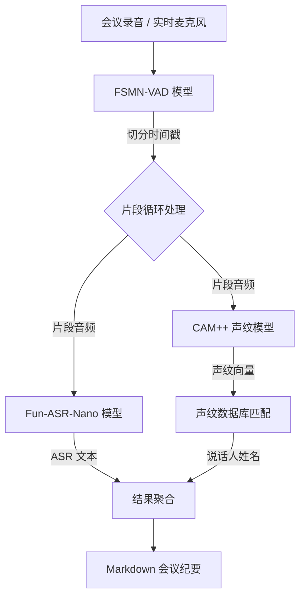

# 声纹识别 Demo (Fun-ASR-Nano)

基于阿里达摩院 FunASR + Fun-ASR-Nano-2512 的声纹识别演示项目，支持：
- 🎙️ 语音识别 (ASR) - 31 种语言，7 大方言
- 👤 说话人验证 (Speaker Verification)
- 👥 说话人分离 (Speaker Diarization)

## 快速开始

### 1. 安装依赖

```bash
# 创建虚拟环境（推荐）
python -m venv venv
source venv/bin/activate  # Linux/Mac
# 或 venv\Scripts\activate  # Windows

# 安装依赖
pip install -r requirements.txt
```

### 2. 便捷脚本 (推荐)

使用 `run.sh` 脚本可以更方便地执行常用操作：

```bash
# 赋予执行权限
chmod +x run.sh

# 1. 注册声纹
./run.sh register "张三" samples/zhangsan.wav

# 2. 生成会议记录 (自动导出为 Markdown)
./run.sh meeting samples/meeting.wav

# 3. 🔴 实时会议记录 (使用麦克风)
./run.sh live

# 4. 列出已注册声纹
./run.sh list

# 4. 识别说话人
./run.sh identify samples/unknown.wav
```

### 3. 手动运行示例

#### 基础语音识别 + 说话人分离
```bash
python scripts/diarization.py --audio samples/test.wav

# 指定语言和设备
python scripts/diarization.py --audio test.wav --language 英文 --device cuda:0
```

#### 说话人验证（比对两段音频是否同一人）
```bash
python scripts/verification.py --audio1 speaker1.wav --audio2 speaker2.wav
```

#### 声纹注册与识别
```bash
# 注册声纹
python -m app.utils.voiceprint register --name "张三" --audio zhangsan.wav

# 识别说话人
python -m app.utils.voiceprint identify --audio unknown.wav

# 列出已注册声纹
python -m app.utils.voiceprint list
```

## 声纹注册指南

### 音频要求

| 项目 | 推荐值 | 说明 |
|------|--------|------|
| **时长** | **10~30秒** | 太短特征不足，太长也无必要 |
| **格式** | WAV/M4A/MP3 | 16kHz 采样率最佳 |
| **环境** | 安静 | 避免背景噪音、回声 |
| **内容** | 自然朗读 | 覆盖多种音调和语速 |

### 推荐录制文本

以下文本包含多种声调和常用词汇，朗读约 15~20 秒：

> 大家好，我是 [你的名字]。今天天气不错，阳光明媚。最近我在学习人工智能技术，尤其是语音识别和声纹识别。这些技术可以让机器听懂人说话，还能分辨是谁在说话。希望未来能有更多有趣的应用。

### 录制技巧

1. **正常语速**：不要刻意放慢或加快
2. **清晰发音**：每个字读清楚
3. **自然语调**：像平时说话一样
4. **一人一段**：不要多人混着录

## 架构说明

本项目为解决官方自动 Pipeline 在长音频和复杂场景下的稳定性问题，实现了一套**高稳健性的手动 Pipeline**：



### 核心模型组件

| 组件 | 模型名称 | 作用 | 优势 |
|------|----------|------|------|
| **VAD** | `speech_fsmn_vad_zh-cn-16k-common` | 语音活动检测 | 精准切分长音频，避免处理静音区，支持实时流式切分 |
| **ASR** | `Fun-ASR-Nano-2512` | 语音转文字 | **800M 参数 LLM**，支持方言，语义理解强，标点自然，口语规整能力强 |
| **Speaker** | `speech_campplus_sv` | 声纹识别 | 业界领先的声纹模型，准确率高，支持极短音频特征提取 |

## Web 界面

启动服务端后，访问：
👉 **http://localhost:8000/client**

提供以下功能：
1. 实时会议录音与转写
2. 离线会议音频上传与处理（流式反馈）
3. 声纹注册与管理

## 启动服务端

```bash
# 启动 API 服务 (包含 Web 界面)
python -m app.server
```

## 项目结构

```
VoiceprintRecognition/
├── app/                           # 📦 应用代码
│   ├── core.py                    # 🧠 核心模块（ModelService + 配置）
│   ├── server.py                  # 🌐 服务端 API (FastAPI)
│   ├── services/                  # �️ 业务服务
│   │   ├── live.py                # 🔴 实时会议逻辑
│   │   └── meeting.py             # 📝 会议转写逻辑
│   └── utils/                     # ⚙️ 工具库
│       └── voiceprint.py          # 👤 声纹管理工具
├── scripts/                       # 🧪 开发调试脚本
│   ├── interactive.py             # 交互式识别
│   └── ...
├── static/                        # 🖼️ 静态资源
│   └── web_client.html            # Web 客户端
├── Fun-ASR/                       # Fun-ASR 官方仓库 (Submodule)
├── voiceprint_db/                 # 📂 声纹数据库 (自动创建)
├── run.sh                         # 🚀 便捷脚本 (CLI入口)
├── requirements.txt               # 依赖列表
└── Dockerfile                     # 🐳 容器化构建文件
```

## 模型说明

本项目使用 **Fun-ASR-Nano-2512** 端到端语音识别大模型：

| 模型 | 用途 | 特点 |
|------|------|------|
| `Fun-ASR-Nano-2512` | 语音识别 (ASR) | 31 种语言，自动标点，基于 Qwen3-0.6B |
| `speech_campplus_sv` | 说话人验证 (声纹) | CAM++ 模型，高精度声纹识别 |

> **Fun-ASR-Nano 特点**：
> - 支持 31 种语言（东亚、东南亚语言优化）
> - 支持 7 大方言 + 26 种地方口音
> - 自动添加标点符号
> - 高噪音/远场环境识别率 93%+

## 注意事项

1. 支持的音频格式：WAV, MP3, FLAC, M4A 等
2. 推荐采样率：16kHz
3. 首次运行需要下载模型（约 2-3GB），请确保网络畅通
4. GPU 可加速处理，使用 `--device cuda:0`

## 参考资料

- [Fun-ASR-Nano-2512 (HuggingFace)](https://huggingface.co/FunAudioLLM/Fun-ASR-Nano-2512)
- [FunASR GitHub](https://github.com/modelscope/FunASR)
- [Fun-ASR GitHub](https://github.com/FunAudioLLM/Fun-ASR)
