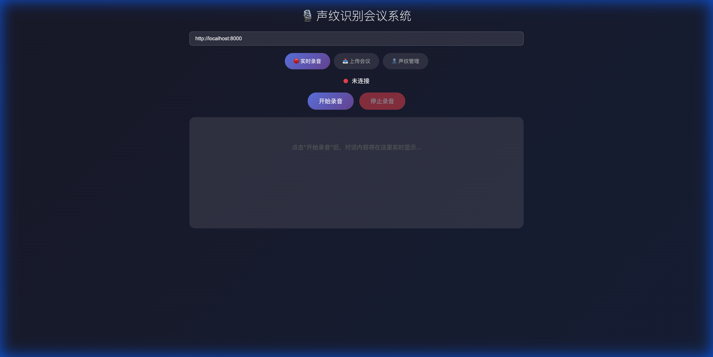
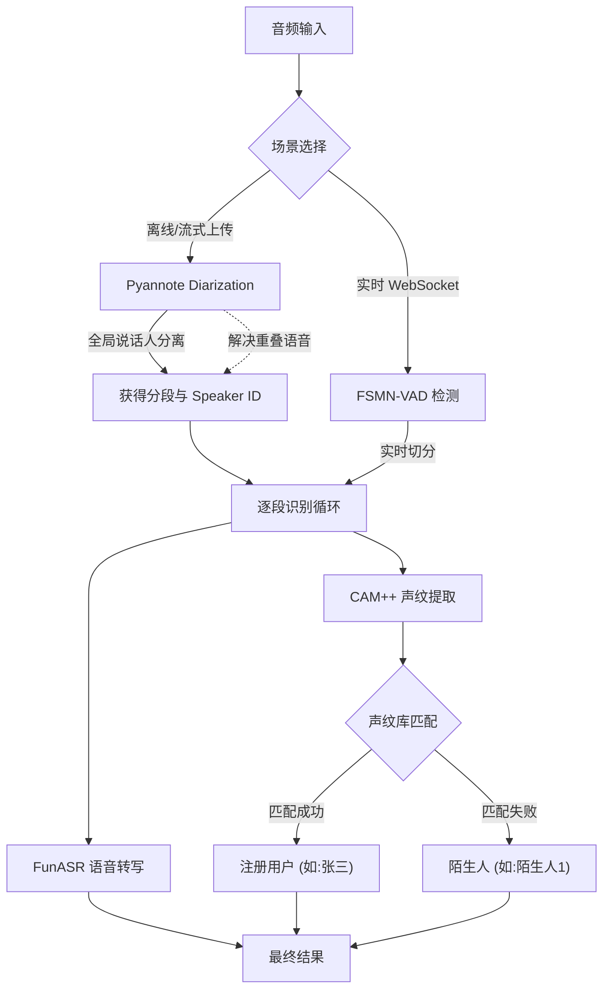

# 声纹识别 Demo (Fun-ASR-Nano)

基于阿里达摩院 FunASR + Fun-ASR-Nano-2512 的声纹识别演示项目，支持：
- 🎙️ 语音识别 (ASR) - 31 种语言，7 大方言
- 👤 说话人验证 (Speaker Verification)
- 👥 说话人分离 (Speaker Diarization)

## 🛠️ 快速开始

### 1. 安装依赖

需要 Python 3.8+ (推荐 3.10)。

```bash
# ⚠️ 重要：初始化子模块 (否则启动会报错)
git submodule update --init --recursive

# 创建虚拟环境
python -m venv venv
source venv/bin/activate  # Windows: venv\Scripts\activate

# 安装依赖
pip install -r requirements.txt
```

### 2. 启动服务与 Web 界面 (推荐)

项目自带了一个现代化的 Web 界面，是快速开始的最佳方式。

1. **启动服务**：
   ```bash
   python -m app.server
   ```

2. **访问界面**：
   打开浏览器访问 [http://localhost:8000/client](http://localhost:8000/client)



### 3. 便捷脚本 (推荐)

使用 `run.sh` 脚本可以更方便地执行常用操作：

```bash
# 赋予执行权限
chmod +x run.sh

# 1. 注册声纹
./run.sh register "张三" samples/zhangsan.wav

# 2. 生成会议记录 (自动导出为 Markdown)
./run.sh meeting samples/meeting.wav

# 3. 🔴 实时会议记录 (使用麦克风)
./run.sh live

# 4. 列出已注册声纹
./run.sh list

# 4. 识别说话人
./run.sh identify samples/unknown.wav
```

### 4. 手动运行示例

#### 基础语音识别 + 说话人分离
```bash
python scripts/diarization.py --audio samples/test.wav

# 指定语言和设备
python scripts/diarization.py --audio test.wav --language 英文 --device cuda:0
```

#### 说话人验证（比对两段音频是否同一人）
```bash
python scripts/verification.py --audio1 speaker1.wav --audio2 speaker2.wav
```

#### 声纹注册与识别
```bash
# 注册声纹
python -m app.utils.voiceprint register --name "张三" --audio zhangsan.wav

# 识别说话人
python -m app.utils.voiceprint identify --audio unknown.wav

# 列出已注册声纹
python -m app.utils.voiceprint list
```

## 声纹注册指南

### 音频要求

| 项目 | 推荐值 | 说明 |
|------|--------|------|
| **时长** | **10~30秒** | 太短特征不足，太长也无必要 |
| **格式** | WAV/M4A/MP3 | 16kHz 采样率最佳 |
| **环境** | 安静 | 避免背景噪音、回声 |
| **内容** | 自然朗读 | 覆盖多种音调和语速 |

### 推荐录制文本

以下文本包含多种声调和常用词汇，朗读约 15~20 秒：

> 大家好，我是 [你的名字]。今天天气不错，阳光明媚。最近我在学习人工智能技术，尤其是语音识别和声纹识别。这些技术可以让机器听懂人说话，还能分辨是谁在说话。希望未来能有更多有趣的应用。

### 录制技巧

1. **正常语速**：不要刻意放慢或加快
2. **清晰发音**：每个字读清楚
3. **自然语调**：像平时说话一样
4. **一人一段**：不要多人混着录

## 🏗️ 系统架构

本项目采用 **双轨制混合架构 (Hybrid Architecture)**，结合了业界领先的深度学习模型，以适应不同的应用场景：

1.  **Pyannote 分离 (精度优先)**：适用于会议记录生成、长音频处理。
2.  **VAD 实时切分 (速度优先)**：适用于实时对话流。



### 核心模型组件

| 组件 | 模型名称 | 作用 | 核心优势 |
|------|----------|------|----------|
| **Diarization** | `pyannote/speaker-diarization-community-1` | **说话人分离** | **SOTA 效果**。能精准区分"谁在说话"，支持 **Overlap (重叠人声)** 分离，能够全局追踪说话人。 |
| **VAD** | `speech_fsmn_vad_zh-cn-16k-common` | 语音活动检测 | **超低延迟**。毫秒级切分音频，用于实时对话或 Pyannote 的回退方案。 |
| **ASR** | `Fun-ASR-Nano-2512` | 语音转文字 | **高精度中文识别**。800M 参数 LLM，语义理解强，自动添加标点，适合口语记录。 |
| **Speaker** | `speech_campplus_sv` | 声纹识别 | **高鲁棒性**。提取声纹特征向量，用于识别已知用户。支持短语音特征提取。 |

## ⚙️ 识别参数配置

声纹识别的核心逻辑基于**余弦相似度 (Cosine Similarity)**，数值范围 `[-1, 1]`，越接近 1 表示越相似。关键参数位于 `app/core.py` 的 `CONFIG` 中：

| 参数 | 默认值 | 说明 | 调整建议 |
|------|--------|------|----------|
| `speaker_threshold` | **0.30** | **声纹判定阈值**。当相似度 > 此值时，判定为"已知用户"；否则为"陌生人"。 | **调高 (如 0.45)**：更严格，减少误认，但可能把本人认成陌生人。<br>**调低 (如 0.20)**：更宽松，容易把陌生人误认为已注册用户。 |
| `min_confidence` | **0.15** | **最低置信度**。低于此分数的结果会被直接丢弃（视为噪音或无效识别）。 | 如果环境嘈杂，可以适当调高此值过滤误识别。 |
| `inheritance_timeout` | **3.0** | **连续说话继承时间(秒)**。在实时流中，如果当前片段未识别出人（或分值低），但在 3秒内上一句是某人说的，则自动继承该说话人。 | 适合对话场景，防止因中间一两句短语识别不清导致说话人频繁跳变。 |

### 判定逻辑流程

1.  提取当前语音片段的声纹特征向量 `Emb_Current`。
2.  计算与所有【已注册用户】声纹向量 `Emb_Registered` 的余弦相似度。
3.  找出最大相似度分数 `Max_Score` 和对应的用户 `User_Best`。
4.  **决策**：
    *   如果 `Max_Score >= speaker_threshold`: 识别结果 = `User_Best`
    *   如果 `Max_Score < speaker_threshold`: 识别结果 = `未知` (后续会被聚类为 "陌生人X")

### 离线运行模式 (Offline Mode)

为了在**无外网**或**免配置 Token** 环境下运行，可以将 Pyannote 模型下载到本地：

```bash
# 1. 临时配置 Token 运行下载脚本
HF_TOKEN=hf_xxx python scripts/download_pyannote.py

# 2. 脚本会自动将模型下载到 project/models/pyannote 目录
# 3. 以后启动时，程序会自动优先加载该目录下的模型，无需再连接 HF
```

### 陌生人聚类逻辑 (Clustering Logic)

系统采用两种策略来处理**未注册用户**（陌生人）：

1.  **Pyannote 内置聚类 (首选)**:
    *   在使用 `diarization` 时，Pyannote 模型内部会自动分析说话人转换。
    *   它能直接输出全局一致的标签（如 `SPEAKER_00`, `SPEAKER_01`），即使中间间隔很久也能识别是同一个人。这是目前最准确的方式。

2.  **DBSCAN 聚类 (回退与实时方案)**:
    *   在 VAD 模式下，系统收集所有标记为"未知"的声纹向量。
    *   使用 **DBSCAN (Density-Based Spatial Clustering)** 算法进行聚类。
    *   **参数**: `eps=0.5` (距离阈值), `metric='cosine'` (余弦距离)。
    *   **逻辑**: 自动发现声纹特征空间中的高密度区域，将其划分为同一组（如 "陌生人1"）。DBSCAN 的优势是不需要预先指定聚类数量（即不需要知道有几个陌生人）。


## 项目结构

```
VoiceprintRecognition/
├── app/                           # 📦 应用代码
│   ├── core.py                    # 🧠 核心模块（ModelService + 配置）
│   ├── server.py                  # 🌐 服务端 API (FastAPI)
│   ├── services/                  # �️ 业务服务
│   │   ├── live.py                # 🔴 实时会议逻辑
│   │   └── meeting.py             # 📝 会议转写逻辑
│   └── utils/                     # ⚙️ 工具库
│       └── voiceprint.py          # 👤 声纹管理工具
├── scripts/                       # 🧪 开发调试脚本
│   ├── interactive.py             # 交互式识别
│   └── ...
├── static/                        # 🖼️ 静态资源
│   └── web_client.html            # Web 客户端
├── Fun-ASR/                       # Fun-ASR 官方仓库 (Submodule)
├── voiceprint_db/                 # 📂 声纹数据库 (自动创建)
├── run.sh                         # 🚀 便捷脚本 (CLI入口)
├── requirements.txt               # 依赖列表
└── Dockerfile                     # 🐳 容器化构建文件
```

## 模型说明

本项目使用 **Fun-ASR-Nano-2512** 端到端语音识别大模型：

| 模型 | 用途 | 特点 |
|------|------|------|
| `Fun-ASR-Nano-2512` | 语音识别 (ASR) | 31 种语言，自动标点，基于 Qwen3-0.6B |
| `speech_campplus_sv` | 说话人验证 (声纹) | CAM++ 模型，高精度声纹识别 |

> **Fun-ASR-Nano 特点**：
> - 支持 31 种语言（东亚、东南亚语言优化）
> - 支持 7 大方言 + 26 种地方口音
> - 自动添加标点符号
> - 高噪音/远场环境识别率 93%+

## 注意事项

1. 支持的音频格式：WAV, MP3, FLAC, M4A 等
2. 推荐采样率：16kHz
3. 首次运行需要下载模型（约 2-3GB），请确保网络畅通
4. GPU 可加速处理，使用 `--device cuda:0` (Linux/Windows) 或 `--device mps` (macOS Native)

## 🐳 Docker 部署

### 1. 构建镜像

构建过程会自动下载模型（Model Baking），因此构建耗时较长，但运行时的容器是即开即用的。

```bash
docker build -t voiceprint-server .
```

### 2. 启动服务

**Linux (支持 GPU加速):**
需要安装 [NVIDIA Container Toolkit](https://docs.nvidia.com/datacenter/cloud-native/container-toolkit/install-guide.html)。

```bash
docker run -d \
  --gpus all \
  -p 8000:8000 \
  -v $(pwd)/voiceprint_db:/app/voiceprint_db \
  --name vp-server \
  voiceprint-server \
  python -m app.server
```

**macOS / 常规 CPU 模式:**

```bash
docker run -d \
  -p 8000:8000 \
  -v $(pwd)/voiceprint_db:/app/voiceprint_db \
  --name vp-server \
  voiceprint-server \
  python -m app.server
```

> **⚠️ macOS 注意事项**: 
> Docker Desktop on Mac 目前无法直接调用 M1/M2/M3 芯片的 GPU (MPS) 进行加速。
> 如果在 Mac 上需要高性能推理，建议直接在本地环境运行（使用 `--device mps`）。

## 参考资料

- [Fun-ASR-Nano-2512 (HuggingFace)](https://huggingface.co/FunAudioLLM/Fun-ASR-Nano-2512)
- [FunASR GitHub](https://github.com/modelscope/FunASR)
- [Fun-ASR GitHub](https://github.com/FunAudioLLM/Fun-ASR)
