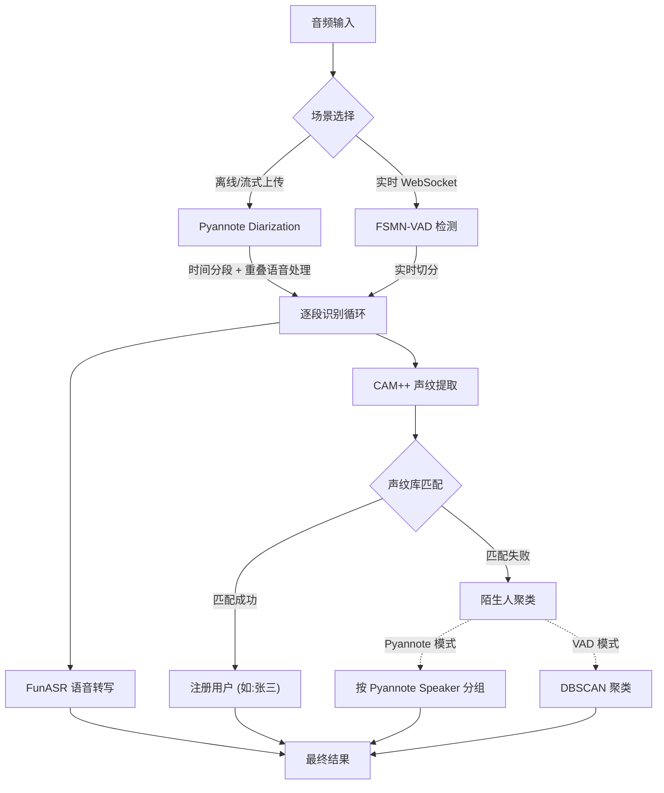

# 声纹识别 Demo (Fun-ASR-Nano)

基于阿里达摩院 FunASR + Fun-ASR-Nano-2512 的声纹识别演示项目，支持：
- 🎙️ 语音识别 (ASR) - 31 种语言，7 大方言
- 👤 说话人验证 (Speaker Verification)
- 👥 说话人分离 (Speaker Diarization)

## 🛠️ 快速开始

### 1. 安装依赖

需要 Python 3.8+ (推荐 3.10)。

```bash
# ⚠️ 重要：初始化子模块 (否则启动会报错)
git submodule update --init --recursive

# 创建虚拟环境
python -m venv venv
source venv/bin/activate  # Windows: venv\Scripts\activate

# 安装依赖
pip install -r requirements.txt
```

### 2. 启动服务与 Web 界面 (推荐)

项目自带了一个现代化的 Web 界面，是快速开始的最佳方式。

1. **启动服务**：
   ```bash
   python -m app.server
   ```

2. **访问界面**：
   打开浏览器访问 [http://localhost:8000/client](http://localhost:8000/client)


### 3. 便捷脚本 (推荐)

使用 `run.sh` 脚本可以更方便地执行常用操作：

```bash
# 赋予执行权限
chmod +x run.sh

# 1. 注册声纹
./run.sh register "张三" samples/zhangsan.wav

# 2. 生成会议记录 (自动导出为 Markdown)
./run.sh meeting samples/meeting.wav

# 3. 🔴 实时会议记录 (使用麦克风)
./run.sh live

# 4. 列出已注册声纹
./run.sh list

# 4. 识别说话人
./run.sh identify samples/unknown.wav
```

### 4. 手动运行示例

#### 基础语音识别 + 说话人分离
```bash
python scripts/diarization.py --audio samples/test.wav

# 指定语言和设备
python scripts/diarization.py --audio test.wav --language 英文 --device cuda:0
```

#### 说话人验证（比对两段音频是否同一人）
```bash
python scripts/verification.py --audio1 speaker1.wav --audio2 speaker2.wav
```

#### 声纹注册与识别
```bash
# 注册声纹
python -m app.utils.voiceprint register --name "张三" --audio zhangsan.wav

# 识别说话人
python -m app.utils.voiceprint identify --audio unknown.wav

# 列出已注册声纹
python -m app.utils.voiceprint list
```

## 声纹注册指南

### 音频要求

| 项目 | 推荐值 | 说明 |
|------|--------|------|
| **时长** | **10~30秒** | 太短特征不足，太长也无必要 |
| **格式** | WAV/M4A/MP3 | 16kHz 采样率最佳 |
| **环境** | 安静 | 避免背景噪音、回声 |
| **内容** | 自然朗读 | 覆盖多种音调和语速 |

### 推荐录制文本

以下文本包含多种声调和常用词汇，朗读约 15~20 秒：

> 大家好，我是 [你的名字]。今天天气不错，阳光明媚。最近我在学习人工智能技术，尤其是语音识别和声纹识别。这些技术可以让机器听懂人说话，还能分辨是谁在说话。希望未来能有更多有趣的应用。

### 录制技巧

1. **正常语速**：不要刻意放慢或加快
2. **清晰发音**：每个字读清楚
3. **自然语调**：像平时说话一样
4. **一人一段**：不要多人混着录

## 🏗️ 系统架构

本项目采用 **双轨制混合架构 (Hybrid Architecture)**，结合了业界领先的深度学习模型，以适应不同的应用场景：

1.  **Pyannote 分离 (精度优先)**：适用于会议记录生成、长音频处理。
2.  **VAD 实时切分 (速度优先)**：适用于实时对话流。



### 核心模型组件

| 组件 | 模型名称 | 作用 | 核心优势 |
|------|----------|------|----------|
| **Diarization** | `pyannote/speaker-diarization-community-1` | **说话人分离** | **SOTA 效果**。能精准区分"谁在说话"，支持 **Overlap (重叠人声)** 分离，能够全局追踪说话人。 |
| **VAD** | `speech_fsmn_vad_zh-cn-16k-common` | 语音活动检测 | **超低延迟**。毫秒级切分音频，用于实时对话或 Pyannote 的回退方案。 |
| **ASR** | `Fun-ASR-Nano-2512` | 语音转文字 | **高精度中文识别**。800M 参数 LLM，语义理解强，自动添加标点，适合口语记录。 |
| **Speaker** | `speech_campplus_sv` | 声纹识别 | **高鲁棒性**。提取声纹特征向量，用于识别已知用户。支持短语音特征提取。 |

## ⚙️ 识别参数配置

声纹识别的核心逻辑基于**余弦相似度 (Cosine Similarity)**，数值范围 `[-1, 1]`，越接近 1 表示越相似。关键参数位于 `app/core.py` 的 `CONFIG` 中：

| 参数 | 默认值 | 说明 | 调整建议 |
|------|--------|------|----------|
| `speaker_threshold` | **0.30** | **声纹判定阈值**。当相似度 > 此值时，判定为"已知用户"；否则为"陌生人"。 | **调高 (如 0.45)**：更严格，减少误认，但可能把本人认成陌生人。<br>**调低 (如 0.20)**：更宽松，容易把陌生人误认为已注册用户。 |
| `min_confidence` | **0.15** | **最低置信度**。低于此分数的结果会被直接丢弃（视为噪音或无效识别）。 | 如果环境嘈杂，可以适当调高此值过滤误识别。 |
| `inheritance_timeout` | **3.0** | **连续说话继承时间(秒)**。在实时流中，如果当前片段未识别出人（或分值低），但在 3秒内上一句是某人说的，则自动继承该说话人。 | 适合对话场景，防止因中间一两句短语识别不清导致说话人频繁跳变。 |

### 判定逻辑流程

1.  提取当前语音片段的声纹特征向量 `Emb_Current`。
2.  计算与所有【已注册用户】声纹向量 `Emb_Registered` 的余弦相似度。
3.  找出最大相似度分数 `Max_Score` 和对应的用户 `User_Best`。
4.  **决策**：
    *   如果 `Max_Score >= speaker_threshold`: 识别结果 = `User_Best`
    *   如果 `Max_Score < speaker_threshold`: 识别结果 = `未知` (后续会被聚类为 "陌生人X")


### 陌生人聚类逻辑 (Clustering Logic)

当 CAM++ 声纹匹配未命中任何注册用户时，系统采用两种策略区分不同的陌生人：

1.  **Pyannote Speaker 分组 (离线模式)**:
    *   Pyannote 负责时间分段和说话人分组（输出 `SPEAKER_00`, `SPEAKER_01` 等标签）。
    *   **身份识别由 CAM++ 逐段独立完成**，不依赖 Pyannote 的 Speaker 分组。
    *   仅当 CAM++ 未匹配到注册人时，才使用 Pyannote 的 Speaker 标签将同一陌生人的多个片段归为一组（如 "陌生人1"）。

2.  **DBSCAN 聚类 (VAD/实时模式)**:
    *   在 VAD 模式下，系统收集所有标记为"未知"的声纹向量。
    *   使用 **DBSCAN (Density-Based Spatial Clustering)** 算法进行聚类。
    *   **参数**: `eps=0.5` (距离阈值), `metric='cosine'` (余弦距离)。
    *   **逻辑**: 自动发现声纹特征空间中的高密度区域，将其划分为同一组（如 "陌生人1"）。DBSCAN 的优势是不需要预先指定聚类数量（即不需要知道有几个陌生人）。


## 项目结构

```
VoiceprintRecognition/
├── app/                           # 📦 应用代码
│   ├── core.py                    # 🧠 核心模块（ModelService + 配置）
│   ├── server.py                  # 🌐 服务端 API (FastAPI)
│   ├── services/                  # �️ 业务服务
│   │   ├── live.py                # 🔴 实时会议逻辑
│   │   └── meeting.py             # 📝 会议转写逻辑
│   └── utils/                     # ⚙️ 工具库
│       └── voiceprint.py          # 👤 声纹管理工具
├── scripts/                       # 🧪 开发调试脚本
│   ├── interactive.py             # 交互式识别
│   └── ...
├── static/                        # 🖼️ 静态资源
│   └── web_client.html            # Web 客户端
├── Fun-ASR/                       # Fun-ASR 官方仓库 (Submodule)
├── voiceprint_db/                 # 📂 声纹数据库 (自动创建)
├── run.sh                         # 🚀 便捷脚本 (CLI入口)
├── requirements.txt               # 依赖列表
├── Dockerfile                     # 🐳 GPU 全量镜像 (~9GB)
├── Dockerfile.slim                # 🐳 GPU 精简镜像 (< 1GB, venv 外挂)
├── Dockerfile.cpu                 # 🐳 CPU 容器构建文件
└── docker-compose.yml             # 🐳 Docker Compose 部署配置
```

## 模型说明

本项目使用 **Fun-ASR-Nano-2512** 端到端语音识别大模型：

| 模型 | 用途 | 特点 |
|------|------|------|
| `Fun-ASR-Nano-2512` | 语音识别 (ASR) | 31 种语言，自动标点，基于 Qwen3-0.6B |
| `speech_campplus_sv` | 说话人验证 (声纹) | CAM++ 模型，高精度声纹识别 |

> **Fun-ASR-Nano 特点**：
> - 支持 31 种语言（东亚、东南亚语言优化）
> - 支持 7 大方言 + 26 种地方口音
> - 自动添加标点符号
> - 高噪音/远场环境识别率 93%+

## 注意事项

1. 支持的音频格式：WAV, MP3, FLAC, M4A 等
2. 推荐采样率：16kHz
3. 首次运行需要下载模型（约 2-3GB），请确保网络畅通
4. GPU 可加速处理，使用 `--device cuda:0` (Linux/Windows) 或 `--device mps` (macOS Native)

## 📋 会议总结 (AI Summary)

转写完成后，可以点击「📋 会议总结」按钮，调用 LLM 自动生成结构化的会议摘要（参会人、关键议题、结论、待办事项等）。

### 配置方式

在项目根目录的 `.env` 文件中配置 LLM 接口（兼容所有 OpenAI 兼容 API）：

```bash
LLM_BASE_URL=https://api.siliconflow.cn/v1   # API 地址
LLM_API_KEY=sk-xxx                            # API 密钥
LLM_MODEL=Pro/deepseek-ai/DeepSeek-V3.2      # 模型名称
```

### 兼容的服务商

| 服务商 | LLM_BASE_URL | LLM_MODEL 示例 |
|--------|-------------|----------------|
| **硅基流动** | `https://api.siliconflow.cn/v1` | `Pro/deepseek-ai/DeepSeek-V3.2` |
| **OpenAI** | `https://api.openai.com/v1` | `gpt-4o-mini` |
| **DeepSeek** | `https://api.deepseek.com/v1` | `deepseek-chat` |
| **智谱 GLM** | `https://open.bigmodel.cn/api/paas/v4` | `glm-4-flash` |
| **Kimi** | `https://api.moonshot.cn/v1` | `moonshot-v1-8k` |
| **通义千问** | `https://dashscope.aliyuncs.com/compatible-mode/v1` | `qwen-turbo` |

> 💡 任何兼容 OpenAI Chat Completions API 的服务都可以使用，只需修改 `LLM_BASE_URL` 和 `LLM_MODEL` 即可。

## 🐳 Docker 部署

项目提供三个 Dockerfile：
- `Dockerfile` — GPU 全量版（基于 `nvidia/cuda`，包含所有依赖，~9GB）
- `Dockerfile.slim` — GPU 精简版（基于 `python:3.10-slim`，venv 外挂，**< 1GB**）
- `Dockerfile.cpu` — CPU 版（基于 `python:3.10-slim`，体积更小）

### 1. 构建镜像

```bash
# GPU 版 (需要 NVIDIA GPU 的 Linux 服务器)
docker build -t voiceprint-server:latest .

# CPU 版 (macOS / 无 GPU 环境)
docker build -f Dockerfile.cpu -t voiceprint-server:cpu .

# 跨架构构建 (如在 ARM Mac 上构建 amd64 镜像并推送到私有仓库)
docker buildx build --platform linux/amd64 -t your-registry/voiceprint-server:latest --push .

# 精简版
docker buildx build --platform linux/amd64  -f Dockerfile.slim -t your-registry/voiceprint-server-slim:latest --push .
```

### 2. 精简镜像部署 (推荐，镜像 < 1GB)

精简镜像不包含 PyTorch、CUDA 等 Python 依赖，通过宿主机挂载 venv 目录运行。适合镜像仓库有大小限制或需要快速分发的场景。

**前置条件：** 宿主机已安装 [NVIDIA Container Toolkit](https://docs.nvidia.com/datacenter/cloud-native/container-toolkit/install-guide.html)，它会在运行时自动将宿主机 CUDA 库注入容器。

按“有网机器准备 -> 离线服务器启动”执行最不容易出错：

1. 有网机器：准备离线部署产物
```bash
# 1) 生成 venv_docker（约 5-10 分钟，~5GB）
bash scripts/build_venv.sh

# 2) 预下载运行时模型（ASR/VAD/SPK）到 models/
python scripts/download_all_models.py

# 上传/离线转写默认使用 Paraformer，建议一并下载
python scripts/download_all_models.py --include-upload-asr

# 3) 准备镜像（可直接 pull 已构建镜像）
docker pull your-registry/voiceprint-server-slim:latest
docker save -o voiceprint-server-slim.tar your-registry/voiceprint-server-slim:latest
```

2. 拷贝到离线服务器
```bash
# 需要拷贝的内容
# - venv_docker/
# - models/
# - voiceprint-server-slim.tar
# - docker-compose.yml / .env
```

3. 离线服务器：导入镜像并启动
```bash
# 1) 导入镜像
docker load -i voiceprint-server-slim.tar
docker tag your-registry/voiceprint-server-slim:latest voiceprint-server-slim:latest

# 2) 启动
docker compose --profile slim up -d --no-build

# 3) 验证
curl http://localhost:18008/
docker images voiceprint-server-slim
```

可通过 `.env` 自定义路径：

```bash
VENV_PATH=./venv_docker          # venv 目录路径（默认 ./venv_docker）
MODELS_PATH=./models             # 本地模型目录（挂载到 /app/models，推荐）
ASR_MODEL_PATH=/app/models/asr/Fun-ASR-Nano-2512
UPLOAD_ASR_BACKEND=paraformer    # 上传/离线转写默认使用 Paraformer；需要旧行为时改回 nano
UPLOAD_ASR_MODEL_PATH=/app/models/asr/speech_paraformer-large-vad-punc_asr_nat-zh-cn-16k-common-vocab8404-pytorch
VAD_MODEL_PATH=/app/models/vad/speech_fsmn_vad_zh-cn-16k-common-pytorch
PUNC_MODEL_PATH=/app/models/punc/punc_ct-transformer_zh-cn-common-vocab272727-pytorch
SPK_MODEL_PATH=/app/models/spk/speech_campplus_sv_zh-cn_16k-common
```

> 纯离线且已配置上述本地模型路径时，无需挂载模型缓存目录（`MODEL_CACHE_PATH` / `HF_CACHE_PATH`）。
> **💡 venv 复用**：`venv_docker/` 构建一次后可在多台同架构机器间复制使用，无需重复构建。

### 3. 使用 Docker Compose 部署 (全量镜像)

需要安装 [NVIDIA Container Toolkit](https://docs.nvidia.com/datacenter/cloud-native/container-toolkit/install-guide.html)。

在 `.env` 文件中配置参数：

```bash
# GPU 设备 ID (默认 0)
NVIDIA_DEVICE_ID=0
# 推理设备 (默认 cuda:0)
DEVICE=cuda:0
# 宿主机端口 (默认 18008)
HOST_PORT=18008
# 声纹数据库路径 (默认 ./voiceprint_db)
VOICEPRINT_DB_PATH=./voiceprint_db
```

```bash
docker compose up -d
```

### 4. 使用 Docker Run 启动

**Linux (GPU 加速):**

```bash
docker run -d \
  --gpus '"device=0"' \
  -p 18008:8000 \
  -v $(pwd)/voiceprint_db:/app/voiceprint_db \
  -e DEVICE=cuda:0 \
  --name voiceprint-server \
  voiceprint-server:latest
```

**macOS / CPU 模式:**

```bash
docker run -d \
  -p 18008:8000 \
  -v $(pwd)/voiceprint_db:/app/voiceprint_db \
  --name voiceprint-server \
  voiceprint-server:cpu
```

> **⚠️ macOS 注意事项**:
> Docker Desktop on Mac 无法调用 M1/M2/M3 芯片的 GPU (MPS) 进行加速。
> 如果在 Mac 上需要高性能推理，建议直接在本地环境运行（使用 `--device mps`）。

## 参考资料

- [Fun-ASR-Nano-2512 (HuggingFace)](https://huggingface.co/FunAudioLLM/Fun-ASR-Nano-2512)
- [FunASR GitHub](https://github.com/modelscope/FunASR)
- [Fun-ASR GitHub](https://github.com/FunAudioLLM/Fun-ASR)
