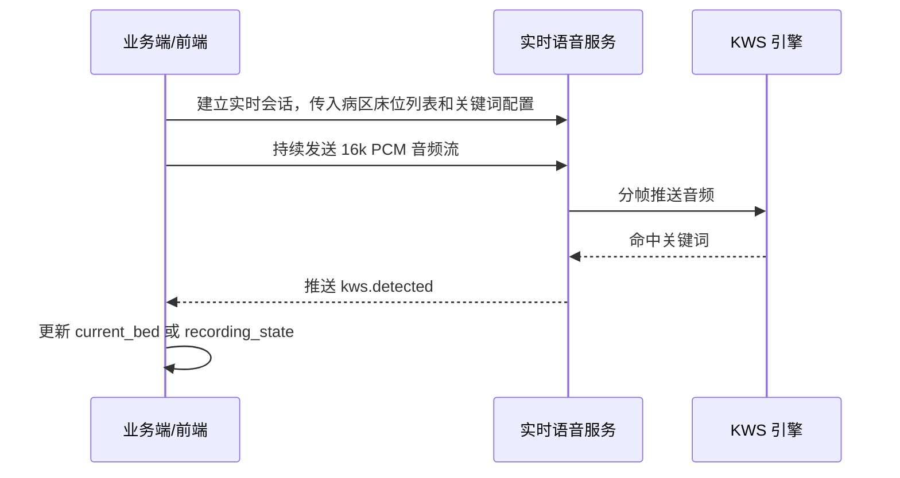
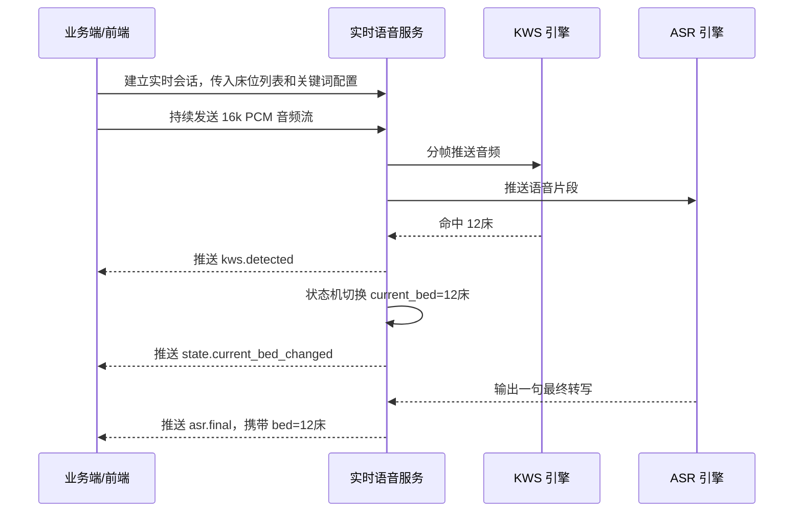

# 实时 KWS 事件交互场景说明

本文只讨论实时场景。KWS 的职责不是完整转写，而是在音频流中快速识别会改变业务状态的关键词，例如床号、下一床、开始记录、暂停记录、结束记录。

## 目标

实时 KWS 输出的是事件，不直接写业务数据。业务端收到事件后再决定是否切换当前床号、更新 UI、创建记录、暂停录音或触发后续流程。

推荐把 KWS 作为实时语音链路的旁路能力：

```text
音频流
  -> KWS 检测床号/指令
  -> 推送 kws.detected 事件
  -> 业务端或语音服务状态机更新 current_bed / recording_state
```

如果业务还需要实时正文转写，再额外暴露 ASR 事件；如果只需要床号/指令切换，则不需要 ASR 文本事件。

## 事件字段约定

所有事件建议包含以下基础字段：

| 字段 | 说明 |
|---|---|
| `type` | 事件类型，例如 `kws.detected` |
| `session_id` | 一次实时查房会话 ID |
| `seq` | 会话内递增序号，用于排序和去重 |
| `ts_ms` | 相对本次音频开始的时间，毫秒 |
| `source` | 事件来源，例如 `kws`、`asr`、`state_machine` |

KWS 命中事件：

```json
{
  "type": "kws.detected",
  "session_id": "round-20260508-001",
  "seq": 18,
  "ts_ms": 1840,
  "source": "kws",
  "category": "bed",
  "keyword": "十二床",
  "normalized": "12床",
  "score": 0.86,
  "start_ms": 1520,
  "end_ms": 1840
}
```

字段说明：

| 字段 | 说明 |
|---|---|
| `category` | `bed`、`command`、`marker` 等 |
| `keyword` | 原始命中的关键词 |
| `normalized` | 归一化后的业务值，例如 `12床` |
| `score` | KWS 置信度 |
| `start_ms` / `end_ms` | 关键词在音频中的时间范围 |

## 场景 A：只有 KWS 事件

### 适用场景

业务端只需要实时知道床号或控制指令，不需要实时拿到医生说的正文。

典型例子：

- 医生说“12床”，前端自动切换到 12床病人页。
- 医生说“下一床”，业务端按当前查房队列切换到下一位病人。
- 医生说“开始记录 / 暂停记录 / 结束记录”，业务端控制录音状态。
- 后续正文由另一个录音/转写系统处理，KWS 只负责给业务系统打状态点。

### 交互流程



### 业务端收到事件后做什么

收到床号事件：

```json
{
  "type": "kws.detected",
  "category": "bed",
  "keyword": "十二床",
  "normalized": "12床",
  "score": 0.86
}
```

业务动作：

```text
1. 校验 score 是否达到业务阈值。
2. 校验 12床 是否在当前查房队列或当前病区床位列表中。
3. 如果通过校验，将 current_bed 切换为 12床。
4. UI 高亮 12床病人卡片。
5. 记录一条状态变更日志，便于事后追溯。
```

收到“下一床”事件：

```json
{
  "type": "kws.detected",
  "category": "command",
  "keyword": "下一床",
  "normalized": "next_bed",
  "score": 0.81
}
```

业务动作：

```text
1. 根据当前 current_bed 和查房队列找到下一张床。
2. 切换 current_bed。
3. UI 跳转或高亮下一位病人。
4. 如果当前没有床号上下文，则提示用户确认或忽略该命令。
```

收到“开始记录 / 暂停记录 / 结束记录”事件：

```json
{
  "type": "kws.detected",
  "category": "command",
  "keyword": "暂停记录",
  "normalized": "pause_recording",
  "score": 0.84
}
```

业务动作：

```text
1. 更新 recording_state。
2. 控制录音、上传或 UI 状态。
3. 对结束类命令可以弹出确认，避免误触发直接结束。
```

### 优点

- 改动最小，业务边界清楚。
- 不要求业务端处理转写文本。
- 适合先验证实时床号/指令识别是否可靠。
- KWS 失败不会影响原有 ASR 或纪要生成链路。

### 限制

- 无法直接生成查房正文。
- 只能解决“当前状态切换”，不能解决“医生说了什么”。
- 如果后续系统需要把正文归属到床号，还需要 ASR 或其他转写链路配合。

## 场景 B：完整事件流

### 适用场景

业务端需要实时看到正文转写，并且希望系统边说边把内容归属到当前床号。

典型例子：

- 医生说“12床，今天体温正常，继续观察”，前端实时显示到 12床查房记录下。
- 医生说“15床，昨晚咳嗽加重”，系统自动切换到 15床并继续追加记录。
- 医生边查房边让护士或医生在界面上实时校对文本。

### 交互流程



### 完整事件示例

KWS 事件：

```json
{
  "type": "kws.detected",
  "session_id": "round-20260508-001",
  "seq": 18,
  "source": "kws",
  "category": "bed",
  "keyword": "十二床",
  "normalized": "12床",
  "score": 0.86,
  "start_ms": 1520,
  "end_ms": 1840
}
```

状态变更事件：

```json
{
  "type": "state.current_bed_changed",
  "session_id": "round-20260508-001",
  "seq": 19,
  "source": "state_machine",
  "current_bed": "12床",
  "reason": "kws.detected",
  "confidence": 0.86,
  "ts_ms": 1840
}
```

ASR 临时文本事件，可选：

```json
{
  "type": "asr.partial",
  "session_id": "round-20260508-001",
  "seq": 20,
  "source": "asr",
  "bed": "12床",
  "text": "今天体温正",
  "start_ms": 2100,
  "end_ms": 3600
}
```

ASR 最终文本事件：

```json
{
  "type": "asr.final",
  "session_id": "round-20260508-001",
  "seq": 21,
  "source": "asr",
  "bed": "12床",
  "text": "今天体温正常，继续观察。",
  "start_ms": 2100,
  "end_ms": 5200
}
```

### 业务端收到事件后做什么

收到 `kws.detected`：

```text
1. 展示短暂命中提示，例如“识别到 12床”。
2. 不直接写正文记录。
3. 等待 `state.current_bed_changed` 确认状态已经切换。
```

收到 `state.current_bed_changed`：

```text
1. 更新业务端 current_bed。
2. UI 切换到对应病人。
3. 后续收到的 ASR 文本默认挂到该床号。
4. 记录状态变更来源和置信度。
```

收到 `asr.partial`：

```text
1. 在 UI 上显示临时转写。
2. 不入库，或者只写临时缓存。
3. 后续被新的 partial 或 final 覆盖。
```

收到 `asr.final`：

```text
1. 将文本追加到事件里的 `bed` 对应病人的查房记录。
2. 如果 `bed` 为空，放入“未归属记录”并提示人工处理。
3. 支持前端人工改床号或修正文案。
4. 入库时保存音频时间范围，方便回听。
```

最终业务数据可以整理为：

```json
{
  "session_id": "round-20260508-001",
  "records": [
    {
      "bed": "12床",
      "items": [
        {
          "text": "今天体温正常，继续观察。",
          "start_ms": 2100,
          "end_ms": 5200,
          "source": "asr"
        }
      ]
    }
  ]
}
```

### 优点

- 支持实时查房记录生成。
- 前端可以边听边显示、边改。
- 床号切换和正文归属都可追溯。
- 适合完整 AI 医生助理或实时查房纪要产品形态。

### 限制

- 业务端复杂度更高，需要处理 partial/final、状态切换和文本归属。
- ASR 延迟和错误仍然存在，KWS 只能解决床号/指令触发。
- 需要处理 KWS 与 ASR 的时间边界，例如床号关键词是否应从正文中剔除。

## 状态机建议

无论采用哪种场景，都建议由状态机统一决定是否真正切换业务状态。

建议规则：

```text
1. KWS 分数低于阈值，不触发状态变化。
2. 命中的床号不在当前查房队列中，不自动切换。
3. 2 秒内重复命中同一床号，只保留第一次。
4. “下一床”依赖当前查房队列；没有 current_bed 时不自动执行。
5. “结束记录”等破坏性命令建议二次确认或需要更高阈值。
6. ASR 文本规则和 KWS 结果冲突时，标记为待确认，不静默覆盖。
```

状态机输出的状态变更事件比原始 KWS 事件更适合业务端消费：

```json
{
  "type": "state.current_bed_changed",
  "current_bed": "12床",
  "reason": "kws.detected",
  "confidence": 0.86
}
```

## 通信方式建议

实时音频输入和事件推送建议优先使用 WebSocket：

```text
Client -> Voice Service: 音频帧、会话控制消息
Voice Service -> Client: kws.detected、state.changed、asr.partial、asr.final
```

如果音频流由其他系统传入，业务系统只接收结果，也可以使用：

| 方式 | 适用场景 |
|---|---|
| WebSocket | 前端实时上传音频并接收事件，首选 |
| SSE | 服务端单向推送事件，音频不通过同一连接上传 |
| 消息队列 | 后端服务解耦，例如语音服务发事件，业务系统订阅 |
| REST 轮询 | 不推荐实时场景，只适合查询历史结果 |

## 选择建议

第一版建议先做场景 A：

```text
只输出 KWS 事件和状态变更事件
不暴露 ASR 文本事件
不改造现有会议转写主链路
```

这样可以用最小改动验证实时床号/指令识别是否有业务价值。

当团队确认需要实时生成按床号归属的查房正文，再升级到场景 B：

```text
KWS 负责切换 current_bed
ASR 负责正文
状态机负责把正文归属到当前床号
业务端负责实时展示、编辑和确认
```
